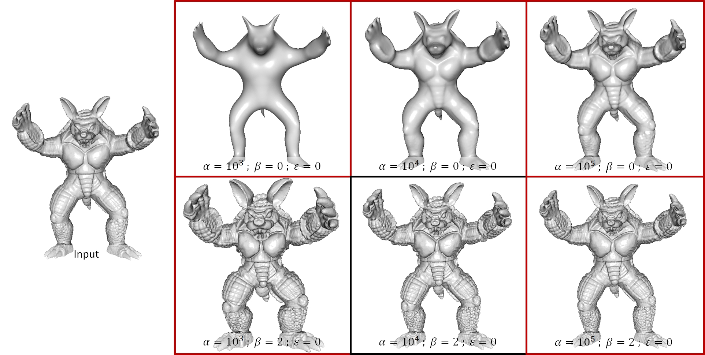

<html>
<head>
<title>Shape Gradient Domain (V1.0)</title>
</head>
<body>

<H2>Shape Gradient Domain (Version 1.0)</H2>

<A HREF="#LINKS">links</A>
<A HREF="#DESCRIPTION">description</A>
<A HREF="#EXECUTABLES">executables</A>
<A HREF="#EXAMPLES">examples</A>
<A HREF="#NOTES">notes</A>
<A HREF="#CHANGES">changes</A>

<A NAME="LINKS"><B>LINKS</B></A> 
<A href="http://www.cs.jhu.edu/~misha/MyPapers/SGP09.pdf">SGP 2009 Paper</A>, <A href="http://www.cs.jhu.edu/~misha/MyPapers/SIG16.pdf">SIGGRAPH 2016 Paper</A> 
<A HREF="http://www.cs.jhu.edu/~misha/Code/ShapeGradientDomain/ShapeGradientDomain.x64.zip">Windows (x64) Executables</A> 
<A href="http://www.cs.jhu.edu/~misha/Code/ShapeGradientDomain/ShapeGradientDomain.zip">Source Code</A> 
 

<A NAME="DESCRIPTION"><B>DESCRIPTION</B></A> 
The code is comprised of two executables.
<UL>

<LI> <B><U>ShapeGradientDomain</U></B>: [<A href="http://www.cs.jhu.edu/~misha/MyPapers/SGP09.pdf">SGP 2009</A>]

This code performs gradient domain processing on signals defined on a mesh, where the signal can be either a color-field represented as a color per vertex or is the position of the vertices themselves..
The code supports both sharpening and smoothing of the signals through the solution of a screened-Poisson equation.
Specifically, given an input signal <I>F</I>, it solves for the signal <I>G</I> minimizing: 

<I>E</I>(<I>G</I>) = &alpha;&sdot;||<I>F</I>-<I>G</I>||2 + ||&beta;&sdot;&nabla;<I>F</I> - &nabla;<I>G</I>||2

 
where &alpha; is the value-fitting weight, and &beta; is the gradient scale factor. 
The code supports inhomogenous processing by allowing the user to replace the Riemannian metric, <I>g</I>, given by the embedding, with a metric that adjusts to the curvature of the surface in two ways.
<OL>
<LI> <U><B>Anisotropic Processing</B></U>: Given orthonormal principal curvature directions, the (idenity) metric is replaced with: 

 Id. + &epsilon;&sdot;&Kappa;2

where Id. is the identity matrix and &Kappa;2 is the diagonal matrix whose entries are the squares of the principal curature values and &epsilon; is the curvature weight. 
<LI> <U><B>Isotropic Processing</B></U>: Given orthonormal principal curvature directions, the (identity) metric is replaced with: 

( 1 + &epsilon;&sdot;tr(&Kappa;2)/2)&sdot;Id.

where tr(&Kappa;2) is the total curvature (the sum of the squares of the principal curvatures) and &epsilon; is the curvature weight. 
</OL>
The curvature is estimated using the surface normals. If none are provided, the vertex normals are estimated as the area-weighted sum of adjacent triangle normals.
<LI> <B><U>Normal Smooth</U></B>: [<A href="http://www.cs.jhu.edu/~misha/MyPapers/SIG16.pdf">SIGGRAPH 2016</A>]

This code performs multiple iterations of harmonic smoothing of the surface normals. As with the code above, this amounts to minimizing: 

<I>E</I>(<I>G</I>) = &gamma;&sdot;||<I>F</I>-<I>G</I>||2 + ||&nabla;<I>G</I>||2

 
where &gamma; is the value-fitting weight. 

If no normals are provided, the vertex normals are estimated as the area-weighted sum of adjacent triangle normals.
</UL>
Note that when &beta; is set to zero the two executables differ in that the first emaulates harmonic flow from the input geometry to Euclidean three-space (allowing the variation at a vertex to occur in any direction) while the second emulates harmonic flow from the input geometry to the two-sphere (constrainting the variation at a vertex to occur in the tangent space of the associated normal).

<A NAME="EXECUTABLES">
<B><U>Shape Gradient Domain Processing</U>:</B> 
<UL>
<DL>
<DT><b>--in</b> &#60;<i>input geometry</i>&#62;
<DD> This string specifies the name of the input geometry, represented in <A HREF="http://www.cc.gatech.edu/projects/large_models/ply.html">PLY</A> format.

<DT>[<b>--out</b> &#60;<i>ouput geometry</i>&#62;]
<DD> This string specifies the name of the output geometry, represented in <A HREF="http://www.cc.gatech.edu/projects/large_models/ply.html">PLY</A> format.

<DT>[<b>--vWeight</b> &#60;<i>value interpolation weight</i>&#62;]
<DD> This floating point value gives the weight for value interpolation (&alpha;). 
The default value for this parameter is 104. 

<DT>[<b>--gScale</b> &#60;<i>gradient scale</i>&#62;]
<DD> This floating point value gives the scale factor for the target gradient field (&beta;). 
The default value for this parameter is 1.0. 

<DT>[<b>--kWeight</b> &#60;<i>curvature weight</i>&#62;]
<DD> This floating point value gives the curvature weight for adjusting the metric (&epsilon;). 
The default value for this parameter is 0.0. 

<DT>[<b>--useColors</b>]
<DD> If this flag is enabled, the signal to be processed is the per-vertex color field. Otherwise, it is the vertex positions. 
If the flag is enabled and the input file does not contain per-vertex colors, colors will be assigned from the normals.

<DT>[<b>--aniso</b>]
<DD> If this flag is enabled and the curvature weight is positive, the metric will be adjusted anisotropically.

<DT>[<b>--verbose</b>]
<DD> If this flag is enabled, the code will output processing information.

</UL>

<B><U>Normal Smoothing</U>:</B> 
<UL>
<DL>
<DT><b>--in</b> &#60;<i>input geometry</i>&#62;
<DD> This string specifies the name of the input geometry, represented in <A HREF="http://www.cc.gatech.edu/projects/large_models/ply.html">PLY</A> format.

<DT>[<b>--out</b> &#60;<i>ouput geometry</i>&#62;]
<DD> This string specifies the name of the output geometry, represented in <A HREF="http://www.cc.gatech.edu/projects/large_models/ply.html">PLY</A> format.

<DT>[<b>--iters</b> &#60;<i>iterations</i>&#62;]
<DD> This integer value specifies the number of smoothing iterations that are to be performed.. 
The default value for this parameter is 1. 

<DT>[<b>--vWeight</b> &#60;<i>value interpolation weight</i>&#62;]
<DD> This floating point value gives the weight for value interpolation (&gamma;). 
The default value for this parameter is 104. 

<DT>[<b>--verbose</b>]
<DD> If this flag is enabled, the code will output processing information.

</UL>

<A NAME="NOTES"><B>NOTES</B></A> 
<UL>
<LI>The code requires a numberical solver and supports either <A HREF="http://eigen.tuxfamily.org">Eigen</A> or <A HREF="http://faculty.cse.tamu.edu/davis/suitesparse.html">CHOLMOD</A>. There are visual studio project files and Makefiles for both. (The code should be easy to interface with Eigen. CHOLMOD promises to be trickier.) 
If you are using Eigen and your implementation is backed by <A HREF="https://software.intel.com/en-us/intel-mkl/">Intel's Math Kernel Library</A> (see discussion <A HREF="https://eigen.tuxfamily.org/dox/TopicUsingIntelMKL.html">here</A>), enable the EIGEN_USE_MKL_ALL flag in NormalSmooth.cpp and ShapeGradientDomain.cpp to take advantage of the more efficient solver.
</UL>

<A NAME="EXAMPLES"><B>EXAMPLES</B></A> 
<UL>
<LI> <B><U>Smoothing/sharpening without metric modification</U></B>
<UL>
<LI> When the gradient scale (&beta;) is set to a value smaller than 1, the gradients are dampened and the geometry is smoothed.
<LI> When the gradient scale (&beta;) is set to a value larger than 1, the gradients are amplified and the geometry is sharpened.
<LI> As the value interpolation weight (&alpha;) is increased, the results better preserve the input gometry, and the smoothing/sharpening is restricted to the higher frequencies.
</UL>

<LI> <B><U>Smoothing with metric modification</U></B>
<UL>
<LI> Since the input geometry is noisy, a direct estimation of curvature would result in large curvature estimates everywhere, resulting in metric amplification everywhere, thereby nullifying the effects of smoothing. 
To mitigate this, we first run an initial pass of normal smoothing (&gamma;=1).
<LI> As the value of the curvature weight (&epsilon;) is increased, the metric around sharp features is amplified, making it harder for the signal to diffuse across the features and resulting in edge-preserving smoothing.
<LI> As the anisotrpic metric modification allows diffusion along direction of low curvature, these results exhibit a bit more smoothing near crease regions.
</UL>

</UL>

<A NAME="CHANGES"><B>CHANGES</B></A> 

<A HREF="http://www.cs.jhu.edu/~misha">HOME</A>

</body>
</html>
