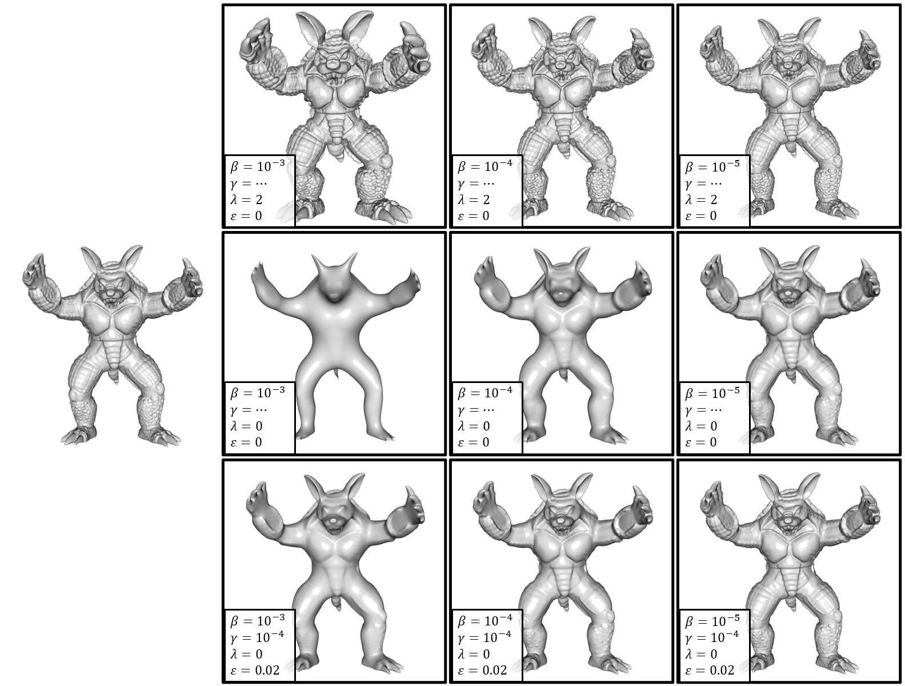

<H2>Shape Gradient Domain (Version 4.0)</H2>

<A HREF="#LINKS">links</A>
<A HREF="#DESCRIPTION">description</A>
<A HREF="#EXECUTABLE">executable</A>
<A HREF="#NOTES">notes</A>
<A HREF="#EXAMPLES">examples</A>
<A HREF="#CHANGES">changes</A>

<A NAME="LINKS"><B>LINKS</B></A> 
[<A href="https://www.cs.jhu.edu/~misha/MyPapers/SGP09.pdf">Chuang et al. 2009</A>], [<A href="https://www.cs.jhu.edu/~misha/MyPapers/SIG16.pdf">Prada et al. 2016</A>], [<A href="https://www.cs.jhu.edu/~misha/MyPapers/JCGT16.pdf">Chuang et al. 2016</A>] 
<A HREF="https://www.cs.jhu.edu/~misha/Code/ShapeGradientDomain/Version4.0/ShapeGradientDomain.x64.zip">Windows (x64) Executables</A> 
<A href="https://www.cs.jhu.edu/~misha/Code/ShapeGradientDomain/Version4.0/ShapeGradientDomain.zip">Source Code</A> 
<A HREF="https://github.com/mkazhdan/ShapeGradientDomain">GitHub Repository</A> 
(Older Versions:
<A href="https://www.cs.jhu.edu/~misha/Code/ShapeGradientDomain/Version3.0/">V3.0</A>,
<A href="https://www.cs.jhu.edu/~misha/Code/ShapeGradientDomain/Version2.0/">V2.0</A>,
<A href="https://www.cs.jhu.edu/~misha/Code/ShapeGradientDomain/Version1.0/">V1.0</A>)
 

<A NAME="DESCRIPTION"><B>DESCRIPTION</B></A> 
<UL>

<!--<LI> <B><U>ShapeGradientDomain</U></B>-->

This code performs gradient domain processing [<A href="https://www.cs.jhu.edu/~misha/MyPapers/SGP09.pdf">Chuang et al. 2009</A>, <A href="https://www.cs.jhu.edu/~misha/MyPapers/JCGT16.pdf">Chuang et al. 2016</A>] on signals defined on a mesh, where the signal can be either a color-field represented as a color per vertex or is the position of the vertices themselves.
The code supports both sharpening and smoothing of the signals through the solution of a screened-Poisson equation.
Specifically, given an input signal <I>F</I>, it solves for the signal <I>G</I> minimizing: 

<I>E</I>(<I>G</I>) = ||<I>F</I>-<I>G</I>||2 + &beta;&sdot;||&lambda;&sdot;&nabla;<I>F</I> - &nabla;<I>G</I>||2

 
where &beta; is the gradient-fitting weight and &lambda; is the gradient scale factor. 
The code supports inhomogenous processing by allowing the user to replace the Riemannian metric, <I>g</I>, given by the embedding, with a metric that adjusts to the curvature of the surface. Specifically, given orthonormal principal curvature directions, the (idenity) metric is replaced with: 

 Id. + &epsilon;&sdot;&Kappa;2

where Id. is the identity matrix, &Kappa;2 is the diagonal matrix whose entries are the squares of the principal curature values, and &epsilon; is the curvature weight. 
Curvatures are estimated using the surface normals. If none are provided, the vertex normals are estimated as the area-weighted sum of adjacent triangle normals.

For more robust estimation of normals, the executable also supports harmonic smoothing of normals as described in [<A href="https://www.cs.jhu.edu/~misha/MyPapers/SIG16.pdf">Prada et al. 2016</A>]. As with the code above, this amounts to minimizing: 

<I>E</I>(<I>G</I>) = ||<I>F</I>-<I>G</I>||2 + &gamma;&sdot;||&nabla;<I>G</I>||2

 
where &gamma; is the diffusion weight. 

In the case that the signal processed describes the vertices' normals, we also support fitting the original geometry to the processed normals using the approach of [<A HREF="https://dl.acm.org/doi/10.1145/1015706.1015774">Yu et al. 2004</A>]. Given input positions <I>F</I> and a target normal field <I>N</I> This amounts to minimizing: 

<I>E</I>(<I>G</I>) = ||<I>F</I>-<I>G</I>||2 + &delta;&sdot;||&nabla;<I>F</I> - <I>N</I>&sdot;&#10216;&nabla;<I>G</I>,<I>N</I>&#10217;||2

 
where &delta; is the projected gradient fitting weight weight. 

</UL>
<!--
Note that when &beta; is set to zero the two executables differ in that the first emaulates harmonic flow from the input geometry to Euclidean three-space (allowing the variation at a vertex to occur in any direction) while the second emulates harmonic flow from the input geometry to the two-sphere (constrainting the variation at a vertex to occur in the tangent space of the associated normal).
-->

<a name="EXECUTABLE"><b>EXECUTABLE</b></a> 

<UL>
<DL>

<b>ShapeGradientDomain</b>:
Processes either the vertex positions, or per-vertex colors, performing isotropic/anisotropic gradient-domain smoothing and sharpening (with the option of smoothing normals in a pre-processing step)

<DT><b>--in</b> &#60;<i>input geometry</i>&#62;
<DD> This string specifies the name of the input geometry, represented in <A HREF="https://www.cc.gatech.edu/projects/large_models/ply.html">PLY</A> format.

<DT>[<b>--out</b> &#60;<i>ouput geometry</i>&#62;]
<DD> This string specifies the name of the output geometry, represented in <A HREF="https://www.cc.gatech.edu/projects/large_models/ply.html">PLY</A> format.

<DT>[<b>--nIters</b> &#60;<i>normal smoothing iterations</i>&#62;]
<DD> This integer value gives the number of iterations of harmonic normal smoothing to be performed before estimating curvatures. (If normal smoothing is desired, we have found that a single iteration suffices.) 
The default value for this parameter is 0. 

<DT>[<b>--nTime</b> &#60;<i>normal diffusion time</i>&#62;]
<DD> This floating point value gives the normal diffusion time (&gamma;). 
The default value for this parameter is 10-4. 

<DT>[<b>--gWeight</b> &#60;<i>gradient interpolation weight</i>&#62;]
<DD> This floating point value gives the weight for gradient interpolation (&beta;). 
The default value for this parameter is 10-4. 

<DT>[<b>--gScale</b> &#60;<i>gradient scale</i>&#62;]
<DD> This floating point value gives the scale factor for the target gradient field (&lambda;). 
The default value for this parameter is 1.0. 

<DT>[<b>--kWeight</b> &#60;<i>curvature weight</i>&#62;]
<DD> This floating point value gives the curvature weight for adjusting the metric (&epsilon;). 
The default value for this parameter is 0.0. 

<DT>[<b>--npWeight</b> &#60;<i>normal projection weight</i>&#62;]
<DD> This floating point value gives the normal projection weight (&delta;). 
The default value for this parameter is 10-3. 

<DT>[<b>--signal</b>]
<DD> This inter value describes which signal is to be processed:
<UL>
<LI><B>0</B>: Vertex positions
<LI><B>1</B>: Vertex normals (will be assigned if none are give)
<LI><B>2</B>: Vertex colors
<LI><B>3</B>: Vertex normals used to fit the geometry.
</UL>
The default value for this parameter is 0.

<DT>[<b>--verbose</b>]
<DD> If this flag is enabled, the code will output processing information.

</DL>
</UL>

<A NAME="NOTES"><B>NOTES</B></A> 
<UL>
<LI> The code requires <A HREF="https://eigen.tuxfamily.org">Eigen</A> as a numerical solver. 
If you are using Eigen and your implementation is backed by <A HREF="https://software.intel.com/en-us/intel-mkl/">Intel's Math Kernel Library</A> (see discussion <A HREF="https://eigen.tuxfamily.org/dox/TopicUsingIntelMKL.html">here</A>), enable the <CODE>EIGEN_USE_MKL_ALL</CODE> macro by defining it in the file <CODE>PreProcessor.h</CODE>. (The two versions of the <A HREF="https://www.cs.jhu.edu/~misha/Code/ShapeGradientDomain/Version4.0/ShapeGradientDomain.x64.zip">Windows executables</A> are compiled with and without MKL support.)
</UL>

<A NAME="EXAMPLES"><B>EXAMPLES</B></A> 
<UL>
The figure below shows example of both isotropic and anisotropic geometry processing. 
<UL>
<LI><B>Top row</B>: Isotropic sharpening:
<PRE>     <CODE>ShapeGradientDomain --in armadillo.ply --out armadillo.sharp.ply --gScale 2 --gWeight &lt;gradient weight&gt; </CODE></PRE>
<LI><B>Middle row</B>: Isotropic smoothing:
<PRE>     <CODE>ShapeGradientDomain --in armadillo.ply --out armadillo.smooth.ply --gScale 0 --gWeight &lt;gradient weight&gt; </CODE></PRE>
<LI><B>Bottom row</B>: Anisotropic smoothing:
<PRE>     <CODE>ShapeGradientDomain --in armadillo.ply --out armadillo.smooth.ply --gScale 0 --gWeight &lt;gradient weight&gt; --kWeight 0.02 --nIters 1 </CODE></PRE>
</UL>
For all three, the value of <CODE>&lt;gradient weight&gt;</CODE> is chosen from {<CODE>1e-3</CODE>, <CODE>1e-4</CODE>, <CODE>1e-5</CODE>}
</UL>

<A NAME="CHANGES"><b><B>HISTORY OF CHANGES</B></b></A>

<a href="https://www.cs.jhu.edu/~misha/Code/ShapeGradientDomain/Version2.0/">Version 2.0</a>:
<OL>
<LI> Added options to weight both value and gradient interpolation terms.
<LI> Changed default values to correspond to diffusion time.
</OL>

<a href="https://www.cs.jhu.edu/~misha/Code/ShapeGradientDomain/Version3.0/">Version 3.0</a>:
<OL>
<LI> Integrated normal smoothing within the gradient-domain processing application.
</OL>

<a href="https://www.cs.jhu.edu/~misha/Code/ShapeGradientDomain/Version4.0/">Version 4.0</a>:
<OL>
<LI> Fixed default value weight to 1.0.
<LI> Added support for fitting the geometry to prescribed normals.
</OL>

